<div align="center">

# Comunica

### Plataforma de Comunicação Institucional Municipal

**Gerencie eventos, releases para a imprensa, solicitações de produção, inscrições e muito mais — tudo em um só lugar, de forma gratuita e open source.**

[](https://nodejs.org)
[](https://www.typescriptlang.org)
[](https://expressjs.com)
[](https://sequelize.org)
[](LICENSE)
[]()

</div>

---

## O que é o Comunica?

O **Comunica** é um sistema web completo desenvolvido para secretarias de comunicação de prefeituras municipais. Ele centraliza o fluxo de trabalho entre as secretarias e a equipe de comunicação: desde a abertura de um chamado de produção até a publicação de um release na imprensa, passando pelo gerenciamento de eventos, inscrições públicas, planejamento estratégico e analytics.

O sistema foi idealizado e desenvolvido de forma independente por **Bruno Pissinatti**, a partir da observação prática dos desafios de comunicação institucional enquanto assessor de mídia parlamentar em Cujubim – RO. O projeto foi construído para ser simples de instalar, fácil de usar e totalmente adaptável a qualquer município brasileiro.

> **É gratuito. É livre. Você pode usar, adaptar e distribuir.**

---

## Capturas de Tela

<details open>
<summary><strong>Tela de Login</strong></summary>
<br>

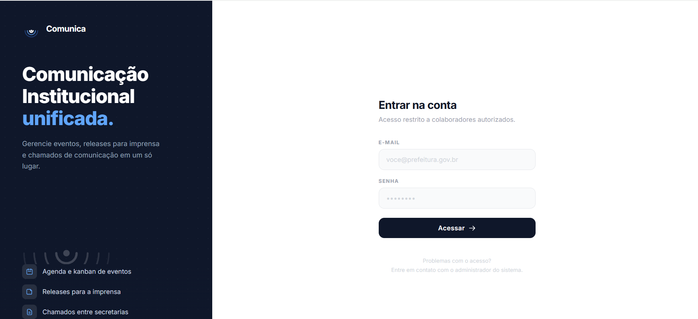

</details>

<details open>
<summary><strong>Dashboard Principal</strong></summary>
<br>

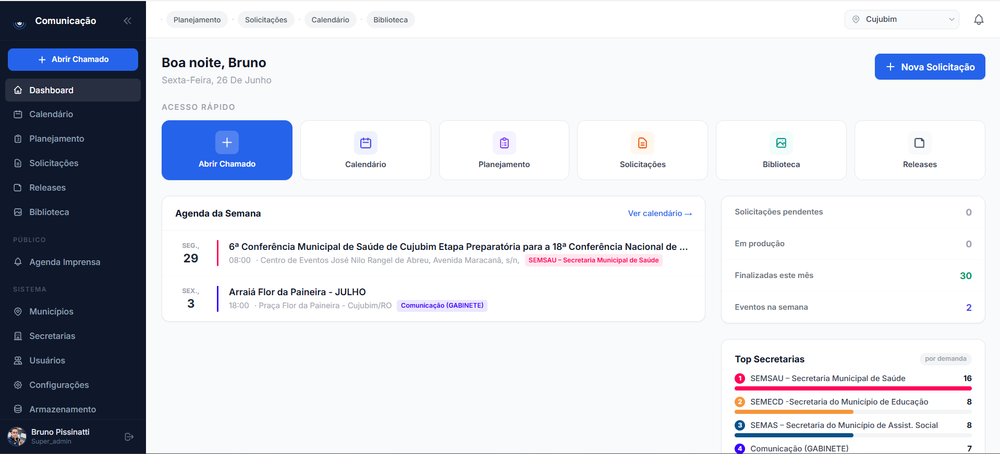

> Visão geral com agenda da semana, solicitações pendentes, estatísticas em tempo real e atalhos rápidos.

</details>

<details>
<summary><strong>Fluxo de Solicitações</strong></summary>
<br>

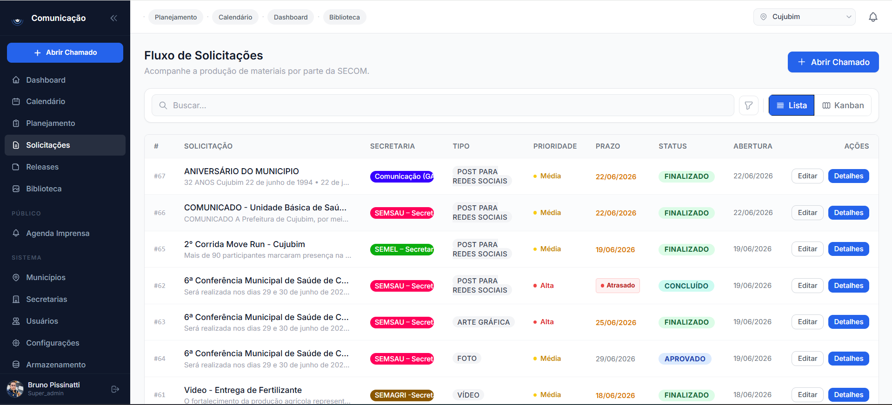

> Gerencie todos os chamados de produção entre secretarias: tipo de mídia, prioridade, prazo, status e histórico completo de comentários.

</details>

<details>
<summary><strong>Calendário Institucional</strong></summary>
<br>

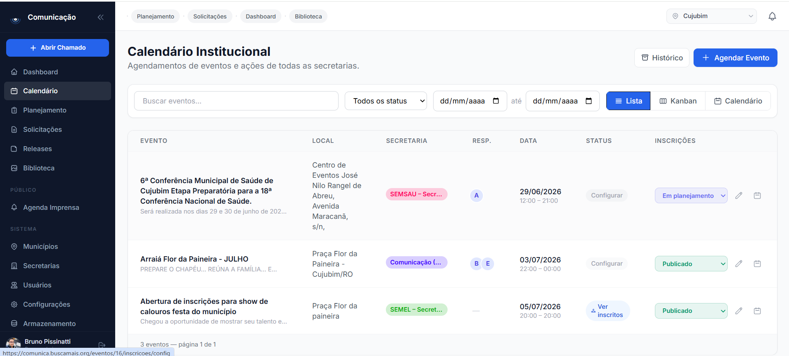

> Agende e visualize todos os eventos municipais. Disponível em visualização de lista, Kanban e calendário mensal.

</details>

<details>
<summary><strong>Gerenciamento de Eventos</strong></summary>
<br>

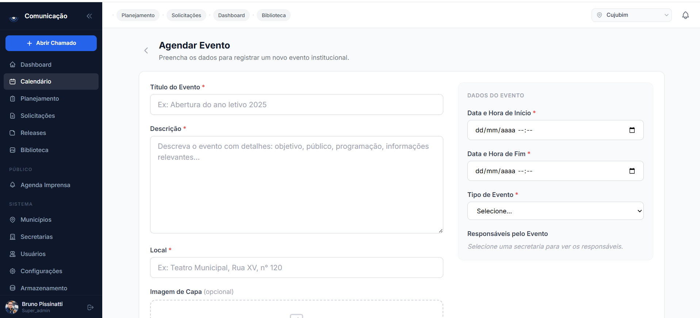

> Crie eventos com título, descrição, local, responsáveis, imagem de capa, tipo e controle de inscrições públicas.

</details>

<details>
<summary><strong>Releases para a Imprensa</strong></summary>
<br>

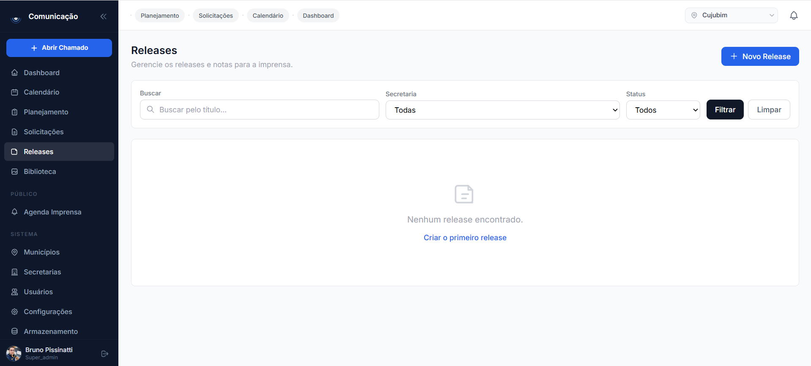

> Crie, revise e publique releases para a imprensa. Vinculados à secretaria responsável, com link e print da publicação.

</details>

<details>
<summary><strong>Biblioteca de Artes</strong></summary>
<br>

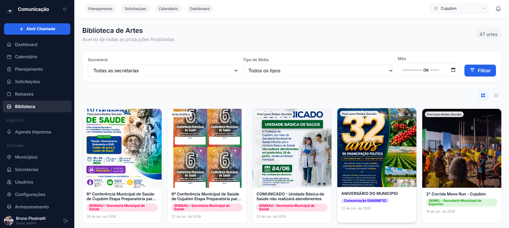

> Acervo centralizado de todas as artes e materiais produzidos, com filtros por secretaria, tipo de mídia e período.

</details>

<details>
<summary><strong>Planejamento Estratégico</strong></summary>
<br>

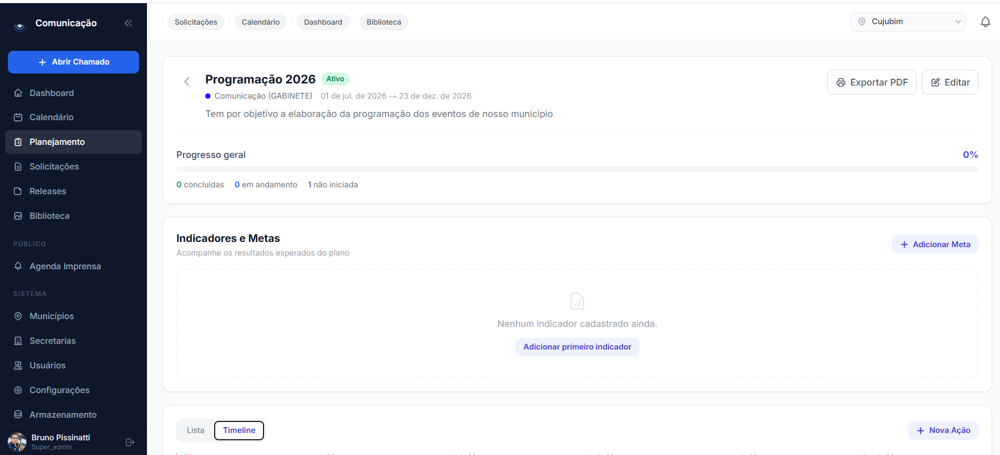

> Planos de ação com timeline, indicadores, metas e progresso. Exportação em PDF.

</details>

<details>
<summary><strong>Dashboard de Analíticos</strong></summary>
<br>

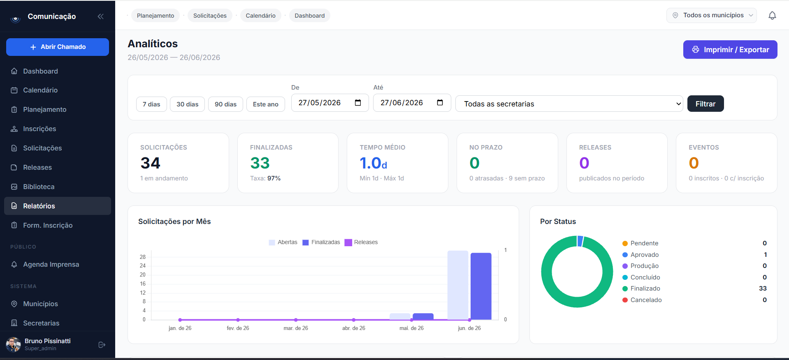

> Painel completo com KPIs: total de solicitações, taxa de conclusão, tempo médio de atendimento, cumprimento de prazo, releases, eventos e gráficos mensais. Filtros por período e secretaria.

</details>

<details>
<summary><strong>Relatório Impresso / PDF</strong></summary>
<br>

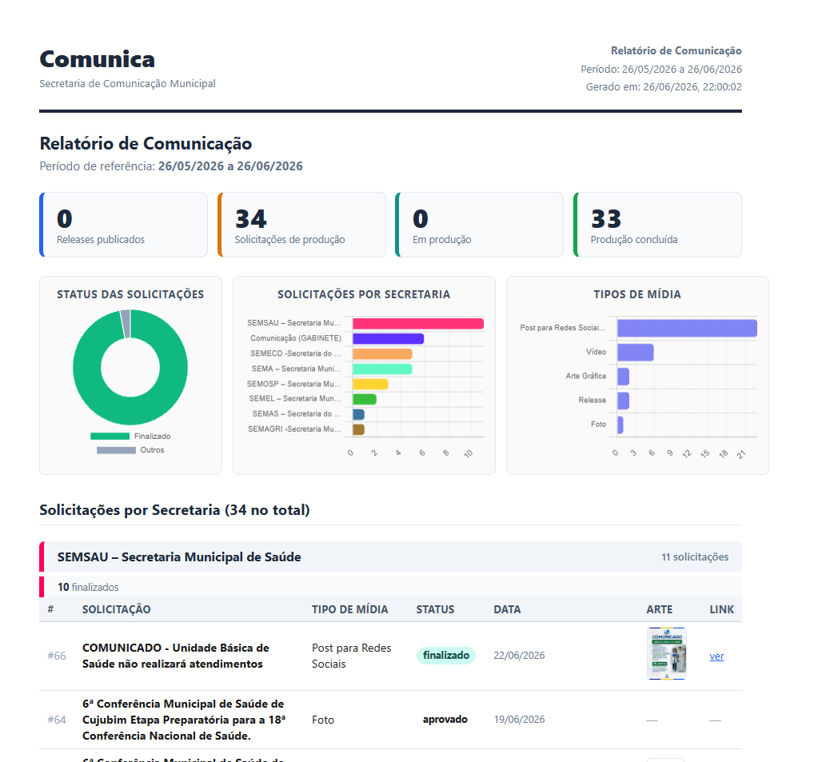

> Gere relatórios em PDF com gráficos de status, distribuição por secretaria e tipos de mídia — diretamente do navegador.

</details>

<details>
<summary><strong>Gerenciamento de Secretarias</strong></summary>
<br>

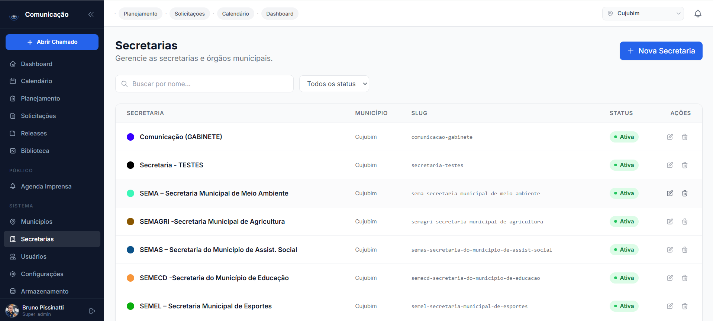

> Cadastre e gerencie as secretarias do município com nome, slug, cor institucional e status.

</details>

<details>
<summary><strong>Suporte a Múltiplos Municípios</strong></summary>
<br>

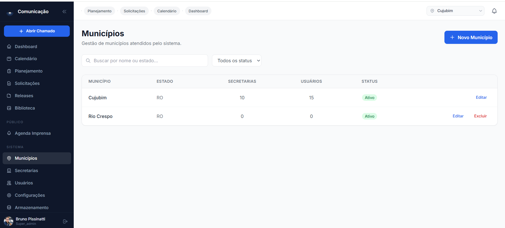

> Uma única instalação pode atender múltiplos municípios com isolamento total de dados entre eles.

</details>

<details>
<summary><strong>Gerenciamento de Armazenamento</strong></summary>
<br>

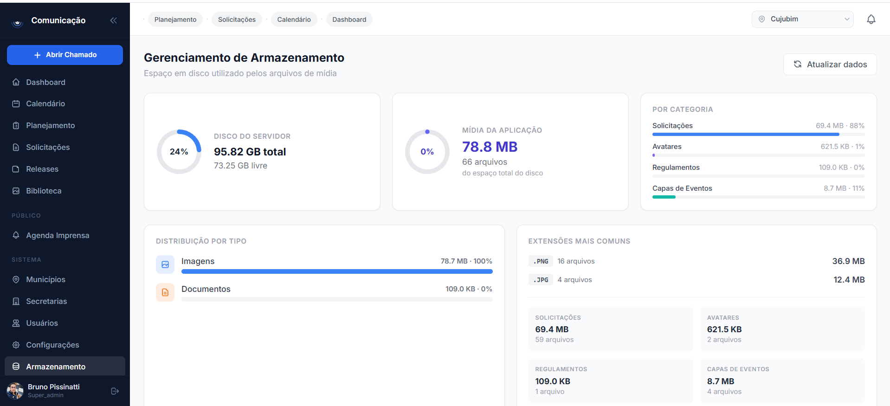

> Monitore o espaço em disco utilizado: total do servidor, mídia da aplicação, distribuição por categoria (solicitações, avatares, regulamentos, capas de eventos) e extensões mais comuns.

</details>

---

## Funcionalidades

### Módulos Principais

| Módulo | Descrição |
|---|---|
| **Dashboard** | Visão geral com agenda semanal, pendências, estatísticas e atalhos |
| **Calendário** | Agenda de eventos institucionais com views de lista, Kanban e calendário |
| **Planejamento** | Planos de ação com timeline, metas e indicadores de desempenho |
| **Solicitações** | Chamados de produção de mídia com fluxo de aprovação e histórico |
| **Releases** | Gestão de press releases com vínculo de publicação e artes |
| **Biblioteca** | Acervo centralizado de artes e materiais produzidos |
| **Inscrições** | Sistema completo de inscrições em eventos com formulário público |
| **Analíticos** | Dashboard com KPIs, gráficos e relatórios imprimíveis/PDF |
| **Agenda da Imprensa** | Página pública com eventos abertos para veículos de comunicação |

### Recursos de Sistema

| Recurso | Descrição |
|---|---|
| **Multi-municípios** | Uma instalação, vários municípios com dados totalmente isolados |
| **Push Notifications** | Notificações em tempo real via Web Push (VAPID) para o navegador |
| **Controle de Acesso** | 5 níveis de permissão com escopo por secretaria e município |
| **Armazenamento** | Gerenciamento visual do espaço em disco utilizado por mídias |
| **Formulários Públicos** | Formulários de inscrição configuráveis por evento |
| **Exportação CSV** | Exportação de listas de inscritos com filtros |
| **Prevenção de Duplicatas** | Validação de e-mail único por evento nas inscrições |
| **Auditoria** | Registro de ações administrativas importantes |

---

## Stack Tecnológica

```
Backend
├── Runtime      Node.js 18+  (TypeScript via tsx — sem compilação)
├── Framework    Express 4.x
├── ORM          Sequelize 6  (SQLite · MySQL · MariaDB · PostgreSQL)
├── Templates    EJS + express-ejs-layouts
├── Sessões      express-session + connect-session-sequelize
├── Segurança    Helmet · bcryptjs · CSP Headers
└── Push         Web Push (VAPID)

Frontend
├── CSS          Tailwind CSS (CDN)
├── Reatividade  Alpine.js v3 (CDN)
└── Gráficos     Chart.js 4 (CDN — somente nas páginas de analíticos)

Infra (recomendado)
├── Processo     PM2 (cluster / autorestart)
└── Proxy        Nginx (HTTPS / SSL)
```

---

## Pré-requisitos

- **Node.js 18+** — [nodejs.org](https://nodejs.org)  
  *(instalação rápida via nvm: `curl -o- https://raw.githubusercontent.com/nvm-sh/nvm/v0.39.7/install.sh | bash && nvm install 20`)*
- **npm** — incluído com o Node.js
- **Git** — `sudo apt install git`
- **PM2** — instalado automaticamente pelo `setup.sh`
- **Banco de dados** — SQLite (zero configuração), MySQL, MariaDB ou PostgreSQL

---

## Instalação Rápida

### 1. Clone o repositório

```bash
git clone https://github.com/seu-usuario/comunica.git
cd comunica
```

### 2. Execute o script de instalação interativo

```bash
bash setup.sh
```

O script percorre **7 etapas automáticas**:

| Etapa | O que faz |
|---|---|
| **1 — Requisitos** | Verifica Node.js 18+, npm e git |
| **2 — Configuração** | Pergunta porta, URL pública, **fuso horário**, banco de dados e e-mail VAPID |
| **3 — Diretórios** | Cria `database/`, `logs/` e `public/uploads/` |
| **4 — Dependências** | Executa `npm install` e garante o driver do banco escolhido |
| **5 — PM2** | Instala PM2 (se necessário) e inicia a aplicação |
| **6 — Validação** | Aguarda a aplicação responder na porta configurada |
| **7 — Boot** | Configura o PM2 para reiniciar automaticamente com o servidor |

> Se o `.env` já existir, o script pergunta antes de sobrescrever e cria um backup automático.

Ao final, acesse a URL configurada com as credenciais padrão:

```
E-mail : admin@comunica.gov.br
Senha  : admin123
```

> **IMPORTANTE:** Troque a senha imediatamente após o primeiro acesso.

---

## Instalação Manual (sem o script)

Use este caminho se quiser controle total ou estiver integrando em um pipeline de CI/CD.

**1. Copie e edite o arquivo de configuração:**

```bash
cp .env.example .env
nano .env   # ou vim .env
```

**2. Crie os diretórios necessários:**

```bash
mkdir -p database logs public/uploads
```

**3. Instale as dependências:**

```bash
npm install
```

**4. Gere as chaves VAPID para push notifications:**

```bash
npx web-push generate-vapid-keys
# Cole as chaves geradas nas variáveis VAPID_PUBLIC_KEY e VAPID_PRIVATE_KEY do .env
```

**5. Inicie com PM2:**

```bash
npm install -g pm2
pm2 start ecosystem.config.cjs --env production
pm2 save
pm2 startup   # execute o comando sudo que o PM2 exibir para auto-start no boot
```

**Desenvolvimento local (com hot-reload):**

```bash
npm run dev
# Aplicação em: http://localhost:3020
```

---

## Variáveis de Ambiente

O arquivo `.env.example` contém todas as variáveis disponíveis com explicações. Copie-o para `.env` e ajuste:

```bash
cp .env.example .env
```

As variáveis essenciais são:

| Variável | Descrição | Padrão / Exemplo |
|---|---|---|
| `NODE_ENV` | Ambiente de execução | `production` |
| `PORT` | Porta interna da aplicação | `3020` |
| `APP_URL` | URL pública completa (com https) | `https://comunicacao.prefeitura.gov.br` |
| `TZ` | Fuso horário do servidor | `America/Sao_Paulo` |
| `SESSION_SECRET` | Chave secreta das sessões — gere com `node -e "require('crypto').randomBytes(48).toString('hex')"` | — |
| `DB_DIALECT` | Banco de dados: `sqlite` \| `mysql` \| `mariadb` \| `postgres` | `sqlite` |
| `DB_STORAGE` | Caminho do arquivo SQLite (apenas se `DB_DIALECT=sqlite`) | `./database/app.sqlite` |
| `DB_HOST` | Host do banco (MySQL/MariaDB/PostgreSQL) | `localhost` |
| `DB_PORT` | Porta do banco | `3306` / `5432` |
| `DB_NAME` | Nome do banco | — |
| `DB_USER` | Usuário do banco | — |
| `DB_PASS` | Senha do banco | — |
| `VAPID_PUBLIC_KEY` | Chave pública VAPID — gere com `npx web-push generate-vapid-keys` | — |
| `VAPID_PRIVATE_KEY` | Chave privada VAPID | — |
| `VAPID_EMAIL` | E-mail de contato para o servidor push | — |

> **Sobre as chaves VAPID:** uma vez que usuários ativaram notificações no navegador, **nunca regenere** essas chaves — todas as inscrições existentes seriam invalidadas.

---

## Configuração do Nginx (HTTPS)

Exemplo de configuração recomendada para produção com SSL:

```nginx
server {
    listen 80;
    server_name comunicacao.suaprefeitura.gov.br;
    return 301 https://$host$request_uri;
}

server {
    listen 443 ssl;
    server_name comunicacao.suaprefeitura.gov.br;

    ssl_certificate     /etc/letsencrypt/live/comunicacao.suaprefeitura.gov.br/fullchain.pem;
    ssl_certificate_key /etc/letsencrypt/live/comunicacao.suaprefeitura.gov.br/privkey.pem;

    client_max_body_size 50M;

    location / {
        proxy_pass         http://127.0.0.1:3020;
        proxy_http_version 1.1;
        proxy_set_header   Upgrade $http_upgrade;
        proxy_set_header   Connection 'upgrade';
        proxy_set_header   Host $host;
        proxy_set_header   X-Real-IP $remote_addr;
        proxy_set_header   X-Forwarded-For $proxy_add_x_forwarded_for;
        proxy_set_header   X-Forwarded-Proto $scheme;
        proxy_cache_bypass $http_upgrade;
    }
}
```

Para obter o certificado SSL gratuito com Let's Encrypt:

```bash
sudo apt install certbot python3-certbot-nginx
sudo certbot --nginx -d comunicacao.suaprefeitura.gov.br
```

---

## Atualizações

Para atualizar a aplicação a partir do repositório Git:

```bash
bash update.sh
```

O script executa **5 etapas**:

1. **Verificação** — confirma que é um repositório git com remote configurado e avisa sobre arquivos modificados localmente
2. **Busca** — conecta ao GitHub e lista os novos commits disponíveis
3. **Atualização** — aplica o código novo (preserva o `.env` e `public/uploads/`)
4. **Dependências** — executa `npm install` somente se `package.json` foi alterado
5. **Reinício** — reinicia via PM2 e confirma que a aplicação voltou ao ar

Se algo der errado, o script exibe o comando exato para reverter para a versão anterior:
```bash
git log --oneline -5                    # ver versões anteriores
git reset --hard <hash>                 # reverter para versão específica
pm2 restart comunica                    # reiniciar
```

---

## Níveis de Acesso

O sistema possui 5 perfis de usuário com escopos distintos:

| Perfil | Acesso |
|---|---|
| `super_admin` | Acesso total a todos os municípios. Gerencia municípios, secretarias, usuários e configurações globais. |
| `admin` | Administrador de um município. Acesso a todos os módulos do município, incluindo analíticos e armazenamento. |
| `secom` | Operador da secretaria de comunicação. Gerencia solicitações, releases, eventos e relatórios. |
| `secretaria` | Operador de uma secretaria específica. Abre chamados, acompanha andamento e gerencia seus eventos. |
| `user` | Acesso básico de visualização. |

---

## Banco de Dados

O Comunica usa **Sequelize ORM** e suporta três bancos de dados:

| Banco | Recomendação | Observação |
|---|---|---|
| **SQLite** | Servidores simples, municípios de pequeno e médio porte | Zero configuração extra, arquivo único |
| **MySQL / MariaDB** | Produção com maior volume de dados | Requer banco criado previamente |
| **PostgreSQL** | Produção enterprise | Requer banco criado previamente |

As tabelas são criadas automaticamente na primeira execução via `sequelize.sync()`. **Não há migrations manuais necessárias.**

---

## Estrutura do Projeto

```
comunica/
├── server.ts                  # Entry point — Express + rotas + seed inicial
├── ecosystem.config.cjs       # Configuração do PM2
├── setup.sh                   # Script de instalação interativa
├── update.sh                  # Script de atualização via Git
├── seed-demo.ts               # Dados de demonstração
├── .env.example               # Template de variáveis de ambiente
│
├── src/
│   ├── config/
│   │   └── database.ts        # Conexão Sequelize
│   ├── database/
│   │   └── models/            # Modelos Sequelize
│   │       ├── User.ts
│   │       ├── Municipio.ts
│   │       ├── Secretaria.ts
│   │       ├── Evento.ts
│   │       ├── Inscricao.ts
│   │       ├── Solicitacao.ts
│   │       ├── SolicitacaoComentario.ts
│   │       ├── Release.ts
│   │       ├── PlanoAcao.ts
│   │       ├── AcaoPlanejamento.ts
│   │       ├── IndicadorMeta.ts
│   │       ├── Arquivo.ts
│   │       ├── Notificacao.ts
│   │       ├── FormularioTemplate.ts
│   │       └── index.ts       # Associações e exportações
│   ├── middlewares/
│   │   └── auth.middleware.ts # isAuthenticated, guards de role
│   ├── lib/
│   │   ├── push.ts            # Web Push helper
│   │   └── sse.ts             # Server-Sent Events broker
│   └── modules/               # Um diretório por módulo de domínio
│       ├── admin/             # Painel admin, usuários, configurações
│       ├── auth/              # Login, logout, sessão
│       ├── biblioteca/        # Biblioteca de artes
│       ├── eventos/           # Calendário e gestão de eventos
│       ├── formularios/       # Templates de formulários de inscrição
│       ├── imprensa/          # Agenda pública para veículos de imprensa
│       ├── inscricao-publica/ # Formulário público de inscrição
│       ├── inscricoes/        # Gestão interna de inscritos
│       ├── notificacoes/      # Central de notificações
│       ├── planejamento/      # Planos de ação e indicadores
│       ├── push/              # Endpoints de push subscription
│       ├── relatorios/        # Analytics e relatórios PDF
│       ├── releases/          # Releases para a imprensa
│       └── solicitacoes/      # Chamados de produção de mídia
│
├── src/views/                 # Templates EJS
│   ├── layouts/
│   │   ├── main.ejs           # Layout principal (sidebar + topbar)
│   │   └── print.ejs          # Layout para impressão/PDF
│   └── [modulo]/              # Views de cada módulo
│
├── public/                    # Arquivos estáticos
│   ├── uploads/               # Mídias enviadas pelos usuários
│   └── icon-*.png             # Ícones PWA
│
├── database/                  # Arquivo SQLite (gerado automaticamente)
├── logs/                      # Logs do PM2
└── img/                       # Screenshots para documentação
```

---

## Comandos PM2 Úteis

```bash
pm2 status                    # Ver status de todos os processos
pm2 logs comunica             # Logs em tempo real
pm2 logs comunica --lines 50  # Últimas 50 linhas de log
pm2 restart comunica          # Reiniciar a aplicação
pm2 stop comunica             # Parar a aplicação
pm2 monit                     # Monitor de CPU e memória em tempo real
pm2 startup                   # Configurar auto-start no boot
```

---

## Dados de Demonstração

Para popular o sistema com dados fictícios para testes:

```bash
node_modules/.bin/tsx seed-demo.ts
```

Isso criará secretarias, eventos, solicitações e releases de exemplo para que você possa explorar todas as funcionalidades sem precisar cadastrar dados manualmente.

---

## Push Notifications

O Comunica suporta notificações em tempo real via **Web Push (VAPID)**:

- Usuários recebem notificações no navegador (mesmo com a aba fechada)
- Notificações são enviadas para: novas solicitações, mudanças de status e eventos próximos
- As chaves VAPID são geradas automaticamente pelo `setup.sh`

Para gerar as chaves manualmente:

```bash
npx web-push generate-vapid-keys
```

---

## Contribuindo

Contribuições são muito bem-vindas! Este projeto nasceu da necessidade real de um município e pode ser melhorado para atender a outros contextos.

### Como contribuir

1. Faça um fork do repositório
2. Crie uma branch para sua feature: `git checkout -b feature/minha-funcionalidade`
3. Faça commit das suas alterações: `git commit -m 'feat: adiciona minha funcionalidade'`
4. Envie para o GitHub: `git push origin feature/minha-funcionalidade`
5. Abra um Pull Request

### Ideias de contribuição

- Suporte a outros idiomas (internacionalização i18n)
- Integração com APIs de redes sociais para agendamento de posts
- Módulo de ouvidoria / protocolo
- Integração com Diário Oficial eletrônico
- Temas visuais / modo escuro
- Testes automatizados (Vitest / Playwright)
- App mobile progressivo (PWA melhorado)

---

## Licença

Este projeto é distribuído sob a **licença MIT**. Você pode usar, copiar, modificar e distribuir livremente, inclusive para fins comerciais, desde que mantenha o aviso de copyright.

```
MIT License

Copyright (c) 2026 Bruno Pissinatti

Permission is hereby granted, free of charge, to any person obtaining a copy
of this software and associated documentation files (the "Software"), to deal
in the Software without restriction, including without limitation the rights
to use, copy, modify, merge, publish, distribute, sublicense, and/or sell
copies of the Software, and to permit persons to whom the Software is
furnished to do so, subject to the following conditions:

The above copyright notice and this permission notice shall be included in all
copies or substantial portions of the Software.

THE SOFTWARE IS PROVIDED "AS IS", WITHOUT WARRANTY OF ANY KIND, EXPRESS OR
IMPLIED, INCLUDING BUT NOT LIMITED TO THE WARRANTIES OF MERCHANTABILITY,
FITNESS FOR A PARTICULAR PURPOSE AND NONINFRINGEMENT. IN NO EVENT SHALL THE
AUTHORS OR COPYRIGHT HOLDERS BE LIABLE FOR ANY CLAIM, DAMAGES OR OTHER
LIABILITY, WHETHER IN AN ACTION OF CONTRACT, TORT OR OTHERWISE, ARISING FROM,
OUT OF OR IN CONNECTION WITH THE SOFTWARE OR THE USE OR OTHER DEALINGS IN THE
SOFTWARE.
```

---

## Sobre o Projeto

O **Comunica** foi idealizado e desenvolvido por **Bruno Pissinatti**, de forma independente e em caráter pessoal, como resposta aos desafios reais de comunicação institucional observados no exercício da função de assessor de mídia parlamentar.

Acreditamos que ferramentas de gestão pública de qualidade devem ser acessíveis a todos os municípios, independentemente do tamanho ou orçamento. Por isso, o projeto é disponibilizado de forma livre e gratuita, sob licença MIT.

---

<div align="center">

Desenvolvido com dedicação para municípios brasileiros.

**Se este projeto foi útil para você, deixe uma ⭐ no GitHub!**

</div>
